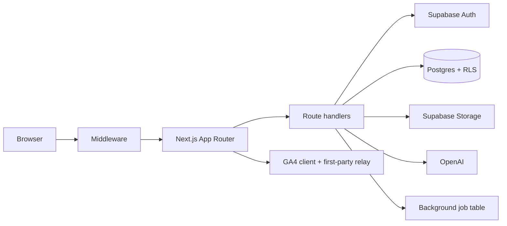

# MXVL Architecture

MXVL is a Next.js App Router application deployed on Vercel. Client and server components call route handlers under `app/api`; server routes use the Supabase service client only after authenticating the caller. Supabase provides Auth, Postgres, Storage, and Realtime. OpenAI-backed recruiting helpers use deterministic fallbacks when the provider is unavailable.

## Boundaries

- `app/`: routes, layouts, pages, route handlers.
- `components/`: UI and feature workspaces.
- `lib/ats`, `lib/crm`, `lib/ai`: domain and integration services.
- `lib/api`, `lib/observability`: typed errors, correlation, redacted logging.
- `supabase-*.sql`: additive migrations applied through the Supabase SQL editor or migration runner.
- `tests/` and `e2e/`: unit/integration and browser checks.

All protected writes must authenticate the bearer token, resolve the role server-side, validate ownership/permission, and use explicit database columns.
