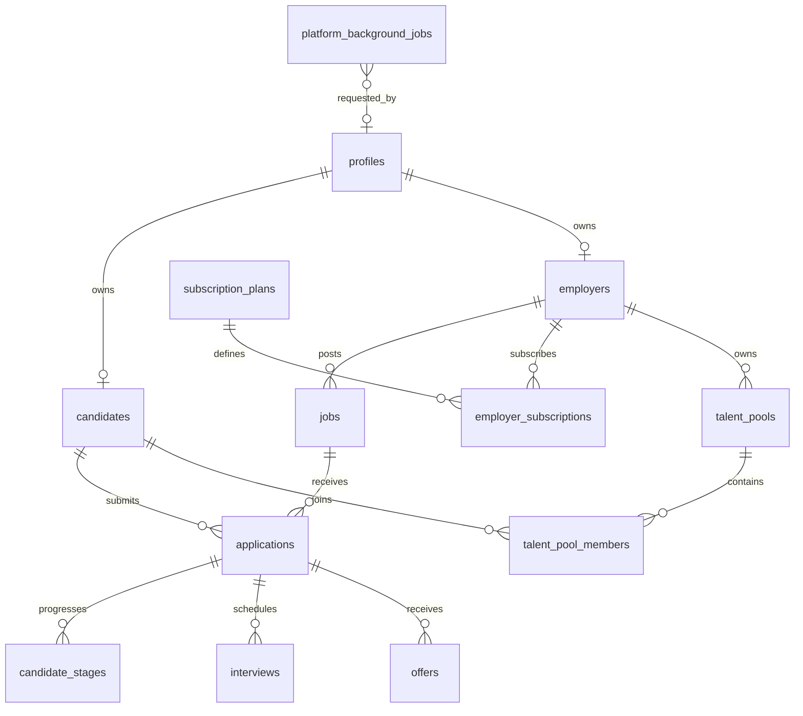

# Database Guide

## Hardening migration

Apply `supabase-platform-hardening.sql` after the existing subscription, ATS, and Talent CRM migrations. It adds queue, AI telemetry, and audit tables plus lookup indexes. All three new tables have RLS enabled and intentionally have no browser policies; access is service-role only.

## Operational checks

Run `EXPLAIN (ANALYZE, BUFFERS)` for queries above 250 ms. Review `pg_stat_statements` weekly where enabled. Keep foreign keys indexed, archive completed queue rows, and retain audit records according to company policy. Never run destructive migrations without a point-in-time backup and tested rollback.
